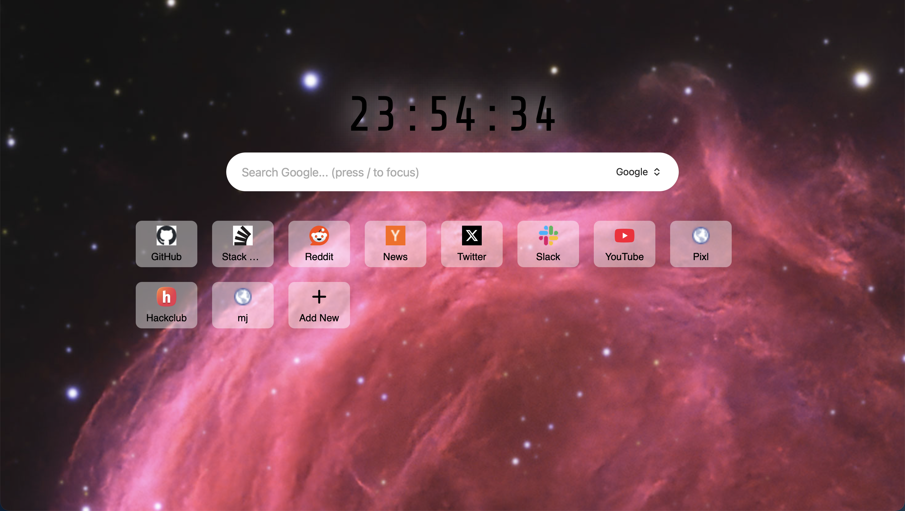

# Simple Tab
is s minimistic new tab page for your browser it is designed to be simple and fast, with a focus on providing quick access to your favorite websites and search engines

https://ashish757.github.io/simpleTab/

##  Features

* **Daily Space Backgrounds:** Automatically fetches high-resolution daily space photography directly from the NASA Astronomy Picture of the Day (APOD) API.

* **Multiple Search Engine:**  toggle between Google, DuckDuckGo and Bing

* **Quick Access:** press `/` to  focus the search bar

* **State Persistence:** preferred search engine and shortcuts are saved in local storage

## 🛠 Tech Stack

* **HTML5:** 
* **CSS3:** 
* **Vanilla JavaScript:** 

## 🚀 How to Run Locally
this is very simple to run locally, as there is no framerwork used

1. Clone  the Repository
2. and simply open the index.html file in your browser
 
 - You may enter your own NASA APOD API key if you want the image background 

# Credits & APIs
This project used  awesome free resources:

- NASA APOD API: For providing stunning daily space imagery
- Google Favicon API: For website icons (https://www.google.com/s2/favicons)
- Google Fonts: For typography styling 
- FontAwesome: For the scalable SVG icons used in the UI